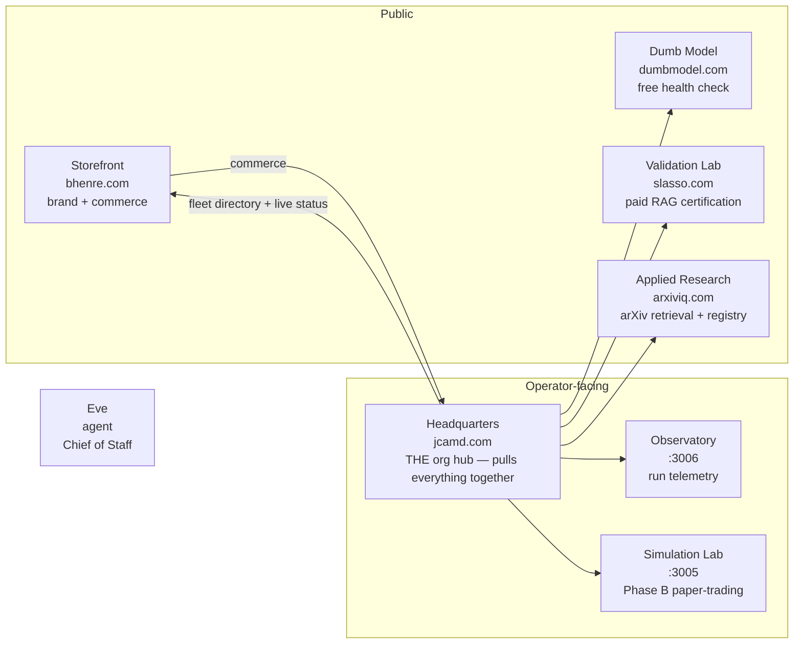

# Fleet rebrand: distinct sites + one org hub

## Goal
Restructure the fleet into clearly distinct sites, with **one org hub (jcamd.com) pulling everything together** and **bhenre.com as the public brand + commerce storefront**. Full rename (ids + packages + dirs + every call site), domains locked, whole-fleet rebrand with all naming inconsistencies resolved.

## Architecture (option C + full rebrand)

## Naming scheme (resolves all 7 inconsistencies)

| Domain (locked) | Cur id | New id | New name | New `SITE_CIRCUIT.stop` | Div | Distinct role |
|---|---|---|---|---|---|---|
| jcamd.com | control | **hq** | Headquarters | Headquarters | orchestration | Org hub — fleet directory, live operating-loop status, lifecycle controls, BD queue, cross-tenant status |
| bhenre.com | hub | **storefront** | Blue Hen RE Storefront | Storefront | orchestration | Public brand + commerce — store, pricing, briefings, contact, legal; proof surfaces /try, /research |
| dumbmodel.com | dumbmodel | dumbmodel | Dumb Model | Baseline Comparison | bd | Free embedder health check & collapse diagnostics (domain-aligned, kept) |
| slasso.com | benchmark-lab | **validation** | Validation Lab | Validation Lab | bd | Paid RAG certification & published scorecards, promotion queue |
| arxiviq.com | research-rag | **research** | Applied Research | Applied Research | research | Live arXiv retrieval assistant & research method registry |
| (none :3005) | finance-lab | **simulation** | Simulation Lab | Simulation Lab | bd | Phase B paper-trading (no live trading) — unifies Omni-Market/Signal/Simulation |
| (none :3006) | training-console | **observatory** | Observatory | Observatory | research | Run telemetry, effective-rank monitoring, collapse alerts |
| (agent) | synthorg | synthorg | Eve | — | orchestration | Fleet agent / Chief of Staff (id/package/dir unchanged — agent infra) |

Decisions: `dumbmodel` id kept (domain = brand; renaming to e.g. "probe" creates a domain mismatch). `synthorg` id/package/dir kept (agent infrastructure, not a public site; renaming cascades into the agent's own imports/CLI — separate high-risk op). Both get display-name alignment only. Override at confirmation if you want either renamed too.

Vercel project **names** (`frontend`, `bluehenre-control`, `agent-lasso`, `arxiv-exam-app`, `dumbmodel`) stay as-is — they are external Vercel project IDs, not user-visible URLs. Only the id→project **keys** in `config/fleet.json` `siteProjects` get rekeyed.

## Key files (the spine)
- [config/fleet.json](config/fleet.json) — ids, names, appPaths, packages, `siteProjects` keys, `platform.controlApp`
- [packages/fleet/src/narrative.ts](packages/fleet/src/narrative.ts) — `SITE_CIRCUIT` (L75-105), `SITE_NAV` (L144-172), `BRAND`, `GLOSSARY`; add missing `observatory` entry
- [packages/fleet/src/workspace-env.ts](packages/fleet/src/workspace-env.ts) — `TENANT_SKIP` set (L11): `control`→`hq`, `finance-lab`→`simulation`
- [packages/ui-fleet/src/FleetShell.tsx](packages/ui-fleet/src/FleetShell.tsx) — `getSite("control")` (L20), hardcoded "Operations Center" (L44), footer "Platform Console"/"Operations Center" (L60-61)
- [packages/ui-fleet/src/tokens.css](packages/ui-fleet/src/tokens.css) — `data-site` selectors (L105-135); add `observatory`
- [apps/control/app/page.tsx](apps/control/app/page.tsx) → `apps/hq` — already runs the fleet directory (L108-138); elevate to canonical hub
- [apps/sites/hub/app/page.tsx](apps/sites/hub/app/page.tsx) → `apps/sites/storefront` — strip "Product surfaces" grid (L224-243) + live cockpit (L220-253) to hq; fix `getSite("control")` (L213)

## Implementation phases

### Phase 1 — Spine: registry + narrative + shared chrome
- `config/fleet.json`: rename 6 ids (control→hq, hub→storefront, benchmark-lab→validation, research-rag→research, finance-lab→simulation, training-console→observatory), update `name`/`description`/`appPath`/`package`, rekey `siteProjects`, set `platform.controlApp` = `apps/hq`, add `observatory` `SITE_CIRCUIT`-equivalent fields.
- `packages/fleet/src/narrative.ts`: rekey `SITE_CIRCUIT` + `SITE_NAV`, update stops/eyebrows/roles, add `observatory` entries (currently missing → shows as raw id in nav).
- `packages/fleet/src/workspace-env.ts`: `TENANT_SKIP` → `["hq","synthorg","simulation"]`.
- `packages/ui-fleet/src/FleetShell.tsx`: `getSite("control")`→`getSite("hq")`; hardcoded "Operations Center" link → "Headquarters"; footer links → "Storefront" (bhenre.com) + "Headquarters" (jcamd.com).
- `packages/ui-fleet/src/tokens.css`: rename `data-site` selectors + add `[data-site="observatory"]`.
- `packages/ui-fleet/src/FleetNavMobile.tsx`: update "Operations Center" (currently dead/unused — fix or delete).

### Phase 2 — Package + directory rename (mechanical core)
- Rename dirs: `apps/control`→`apps/hq` (note: NOT under `apps/sites/`); `apps/sites/{hub,benchmark-lab,research-rag,finance-lab,training-console}`→`apps/sites/{storefront,validation,research,simulation,observatory}`.
- Rename `@synthaembed/*` in each site `package.json` + all importers: `scripts/review.mjs` (L6-11), `scripts/dev-site.mjs` (L17-22), `scripts/fleet-review.ps1` (L19-23, L76).
- Regenerate `pnpm-lock.yaml` (`pnpm install` — **BLK-DISK: free 5+GB first**).
- `FleetShell siteId="..."` in each `app/layout.tsx` (7 files).
- All `getSiteCircuit`/`getSiteNav`/`getSite` string literals in app pages (full list from rename map §2-3: hub ×6, control ×6, dumbmodel ×5, benchmark-lab ×5, research-rag ×3, finance-lab ×1).
- `apps/sites/hub/app/layout.tsx` CommandPalette: align `s.name` with new display names + `hint: "hub"`→`"storefront"` + filter `s.id !== "hub"`→`"storefront"`.

### Phase 3 — Config/data artifacts keyed by id
- `config/recipes/{hub,benchmark-lab,research-rag}.json` → rename files + `siteId` fields (dumbmodel stays).
- `data/workspaces/{id}.env` → rename (gitignored; operator action).
- `data/corpora/research-rag/` → `data/corpora/research/`.
- `content/fleet/bd/queue.json` + `apps/sites/benchmark-lab/data/bd-queue.json`: `siteId: "research-rag"` → `"research"`.
- `config/experiment_hypotheses.json` (L57,73,82,90,98,105): site refs.
- Runtime source tags: `apps/sites/hub/app/api/contact/route.ts:45` `source: "hub/contact"`→`"storefront/contact"`; `apps/sites/finance-lab/app/api/waitlist/route.ts:29` → `"simulation/waitlist"`.

### Phase 4 — Backend + scripts id literals
- `services/core-api/app/main.py:227` `bd_console = tenant.site_id == "benchmark-lab"` → `"validation"` (BD queue breaks otherwise).
- `services/core-api/app/services/handoffs.py:59` same gate.
- `scripts/vercel-env-fleet.mjs:102` `site.id === "control"` → `"hq"`.
- Update `PHASE_A_SITES`/site lists in: `kickoff_lifecycle.py`, `retry_failed_orgs.py`, `train_remaining.py`, `collect_evidence.py`, `experiment_runners.py`, `experiment_campaign.py`, `tenant_baseline.py`, `bootstrap_orgs.py` (`SKIP_SITE_IDS`, `--site research-rag` help), `harvest_arxiv_corpus.py`, `build_experiment_index.py` (output path `apps/sites/hub/data/...`→`storefront`), `research_loop.py`, `bayesian_search.py`, `autoresearch_orchestrate.py`, `build_sync.py`.
- `packages/cli/src/parse-args.ts:14` example text.

### Phase 5 — Role split (the "distinct" deliverable)
- `apps/hq/app/page.tsx` (ex-control): reframe hero as "Headquarters — the org hub." Keep fleet directory + cross-tenant status + lifecycle controls. **Add** the live operating-loop view (move `InteractiveCircuit` + `RaceFeed` + `MilestoneStrip` from hub) so hq is the one place that pulls everything together.
- `apps/sites/storefront/app/page.tsx` (ex-hub): **strip** the "Product surfaces" cross-nav grid (L224-243) and the live operating-loop cockpit (`InteractiveCircuit`/`RaceFeed`/`MilestoneStrip`, L218-253). Keep brand hero, store/pricing/contact CTAs, `/try` + `/research` as proof surfaces. Update fleet StatCard link `getSite("control")`→`getSite("hq")` (L213), relabel "Open Operations Center"→"Open Headquarters".
- `apps/hq/app/actions/page.tsx` + `HillClimbActions.tsx`: keep (lifecycle controls = hq's job).

### Phase 6 — Brand copy + metadata alignment (resolve inconsistencies)
- Per-site `app/layout.tsx` + `app/page.tsx` metadata titles/hero copy: hub "Blue Hen RE — Hub"→"Blue Hen RE — Storefront"; control "Fleet Control"→"Headquarters"; finance-lab unify "Omni-Market..."/"Signal Lab"→"Simulation Lab"; benchmark-lab "RAG Benchmark Lab"→"Validation Lab"; research-rag "Research RAG Org"→"Applied Research".
- `research-rag/data/research_lab.json` title "Research Lab"→ align (use "Applied Research — Research Registry" to match GLOSSARY; avoid colliding with `GLOSSARY.experimentMuseum = "Research Registry"`).
- `dumbmodel/components/site.tsx` (dead legacy nav) — delete or update.
- `training-console` eyebrow "Blue Hen RE · Research Division"→"Observatory".

### Phase 7 — Docs & memory brand alignment
- `AGENTS.md` (L37,44,73-78,101-103), `CLAUDE.md` (L14,41-46), `memory/glossary.md` (L55-77), `memory/projects/{bluehenre,slasso,arxiviq}.md`, `HANDOFF.md`, `README.md`, `docs/wiki/LOCAL_DEV.md` (L33-53), `specs/{0007,0012,0015}.md`, `.cursor/rules/fleet-sites.mdc` (L19), `docs/VOICE_AND_PLATFORM.md` (L32-39), `docs/DESIGN_SYSTEM.md`.

### Phase 8 — Validate
- Free disk (BLK-DISK): `docker system prune -a`, clear `.next` dirs, `%TEMP%`.
- `pnpm install` (regenerate lockfile) → `pnpm review` (build + typecheck all sites) → `uv run pytest services/core-api/tests -q` (site_id gates).
- Grep sweep: `rg "benchmark-lab|research-rag|finance-lab|training-console"` in code → expect only prose/historical refs; `rg 'getSite\("(control|hub)"\)'` → zero hits.
- Smoke: `pnpm dev:stack` + `synth fleet context` render.
- Vercel: re-run `pnpm vercel:link-fleet:exec` (reads fleet.json) to relink under new ids.

## Risks / notes
- **BLK-DISK** blocks `pnpm install`/build — free disk first (Phase 0).
- `data/workspaces/*.env` gitignored — operator must rename locally or bootstrap reruns.
- `core-api` `bd_console` gate (main.py:227, handoffs.py:59) MUST update to `"validation"` or BD queue + promotion flow breaks.
- Existing `data/corpora/research-rag/` data — rename dir so harvest scripts find it.
- Vercel project re-link required after id rename (project names themselves unchanged).
- `FleetNavMobile.tsx` is dead code (zero importers) — opportune delete.
- The deep-review 🔴 findings (eval-harness workspace enrollment, `governance.get_trace`, trainer tests, training-console /runs route) are **out of scope** for this rebrand — separate work.

## Order rationale
Phase 1 (spine) first so all downstream lookups resolve. Phase 2 (dirs/packages) next so imports + builds work. Phase 3-4 (id-keyed artifacts + backend gates) so runtime doesn't break. Phase 5 (role split) is the actual distinctness deliverable, done after wiring is stable. Phase 6-7 (copy/docs) polish. Phase 8 validates the whole thing builds and no stale ids remain.