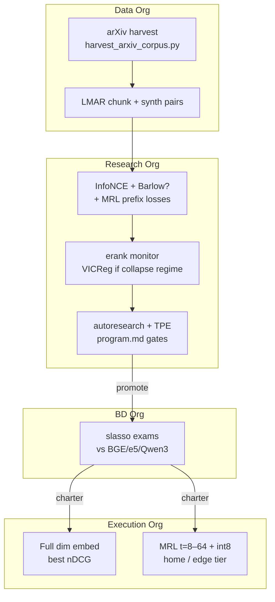

# Frontier Embedding Architecture — Blue Hen RE

**Purpose:** Synthesize *published* SOTA ideas into one honest, edge-deployable stack — without
reinventing what arXiv already solved or re-shipping rejected internal mechanisms.

**Normative companions:** `SCIENCE_REVIEW.md`, `EVIDENCE.md`, `config/literature_registry.json`,
`program.md`, `docs/RESEARCH_ORG_ROADMAP.md`.

---

## 1. The vision (what we are actually building)

Industry teams want embeddings that:

1. **Retrieve well on *their* corpus** — not just MTEB leaderboard averages.
2. **Run on edge / home hardware** — small backbones, truncated dims, int8/binary quant.
3. **Improve continuously** — org lifecycle (collect → train → eval → deploy) with measured gates.

Blue Hen RE is **not** a single novel architecture paper. It is a **mixture-of-published-methods**
platform: open backbone + domain adaptation + Matryoshka edge serving + synthetic-org automation,
with every layer traceable to literature and `EVIDENCE.md`.

---

## 2. What we do NOT reinvent

| Published work | Our stance |
|---|---|
| InfoNCE / SimCLR contrastive training | **Baseline** — shipped; product is org-tuned, not InfoNCE novelty |
| BGE / e5 / OpenAI-class embedders | **Compare only** — dumbmodel + tenant_baseline panel |
| Matryoshka (MRL) | **Adopt** — train prefix losses; do not claim invention |
| Barlow Twins / VICReg | **Evaluate** — Barlow leads synthetic sweep; VICReg collapse-only |
| LoRA / PEFT | **Adopt** — cost control for 0.6B-class backbones |
| QAMA / quant-aware MRL | **Watch** — may upgrade edge tier after ablation |
| ASN spectral surgery | **Rejected** — 0/4 fleet; biology stays inspiration-only |

Run weekly: `pnpm literature:radar` → review `data/literature/radar_latest.md` before new experiments.

---

## 3. Target stack (Frontier Embed Stack v1)



### Layer A — Backbone (open, small, PEFT)

- **Candidates:** `all-MiniLM-L6-v2` (today), `BAAI/bge-small-en-v1.5`, `Qwen/Qwen3-Embedding-0.6B`.
- **Method:** LoRA adapters on attention/FFN; full fine-tune only when PEFT plateaus on tier-1 sweep.
- **Literature:** Hu et al. LoRA; Qwen3-Embedding model card.
- **Edge constraint:** Target ≤0.6B params so a single consumer GPU or strong CPU can serve.

### Layer B — Training objective (measured mixture)

| Component | Role | Status |
|---|---|---|
| InfoNCE | Anchor contrastive signal | **Shipped** — 4/4 tenant wins vs BGE |
| Barlow Twins | Redundancy reduction / robustness | **Evaluating** — synthetic leader; real-text bake-off |
| MRL prefix losses | Truncation without collapse at t=8 | **Shipped config** — needs MRL-trained checkpoint for edge |
| VICReg | Rank floor in collapse regimes | **Regime-specific** — not fleet default |
| ASN surgery | Anti-collapse spectral ops | **Off** — rejected fleet gate |

**Frontier move:** Combine **domain InfoNCE + Barlow (if real-text wins) + MRL** — this is the
industry-relevant mixture; surgery is out until collapse-regime proof returns.

### Layer C — Diagnostics (falsifiable, not marketing)

- **Effective rank** (Roy & Vetterli) — deploy gate + dumbmodel cone.
- **nDCG@10 / Recall@k** — tenant corpora + slasso exams.
- **Tier drop@t** — full vs t=8 vs int8 on same queries.

### Layer D — Serving (two tiers)

| Tier | Params | Use case |
|---|---|---|
| **Full** | d=384 (or backbone dim) | Best retrieval; server / cloud |
| **Edge** | MRL truncate t=8–64 + int8 | Home devices, batch embed, pgvector at scale |

**Next literature upgrade:** QAMA-style joint MRL+quant training vs post-hoc int8 (watchlist in registry).

---

## 4. Research org operating loop (literature-aware)

```
Weekly:  literature:radar → review flagged papers → update literature_registry.json
Daily:   autoresearch (program.md) — ONE hypothesis per night
On KEEP: tier-1 tenant_recipe → BD queue → slasso exam → Execution charter
Data:    harvest:arxiv → kickoff research-rag lifecycle when corpus grows
```

**Before any new mechanism in `autoresearch_train.py`:**

1. Search `config/literature_registry.json` — is it already published?
2. Check `data/literature/radar_latest.json` flagged papers — are we 3 months behind arXiv?
3. If overlap: **cite + ablate**, do not claim novelty; add registry entry with `watchlist` or `evaluating`.

---

## 5. arxiviq.com (research-rag) role in the vision

| Today | Next |
|---|---|
| 8-chunk demo corpus | `pnpm harvest:arxiv` → 80–500 papers |
| Live `/v1/search` | Same + rotating eval slice |
| Research Lab museum | + literature radar digest link |
| Exam step stub | Port arxiv_exam MCQ when corpus scales |

research-rag is the **applied science front**: researchers query *their* embedding stack on
*real arXiv abstracts*, while the hub shows *how* that stack was chosen (EVIDENCE + registry).

---

## 6. Honest SOTA claim boundary

We can say today (with dates in EVIDENCE.md):

- Domain-adapted org embeddings **beat zero-shot BGE** on Phase A tenant corpora (+0.023–0.058 nDCG).
- int8 quantization **preserves ranking** on our panel; truncation **requires MRL training**.
- Weight surgery **does not** improve fleet deploy gates.

We cannot say until tier-2 / MTEB slice + fair commercial panel:

- "SOTA on MTEB" or "beats Qwen3-Embed out of the box everywhere."
- "Collapse-resistant" as a product default (hypothesis only).

---

## 7. Immediate actions (ordered)

1. `pnpm literature:radar` — establish baseline digest.
2. `pnpm harvest:arxiv` — expand research-rag corpus; re-run `kickoff:orgs` for research-rag.
3. Complete **Barlow real-text bake-off** (`scripts/realtext_methods.py`) — unlocks Layer B default.
4. Add **Qwen3-Embed-0.6B** to eval-public baseline panel — fair frontier comparison.
5. Wire **QAMA** watchlist experiment after Barlow gate — edge tier v2.

---

*Updated 2026-06-28. Amend when literature_registry or EVIDENCE gates change.*
