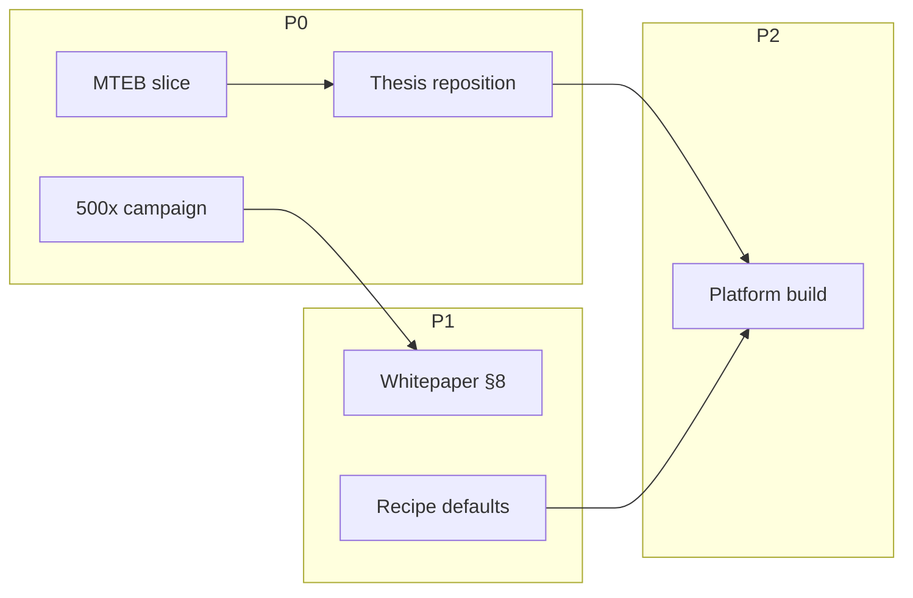

# Ultracode Session — Dynamic Workflow Plan

**Purpose:** Distribute parallel workstreams from the evidence arc (Runs A–D, §3.1–§3.7) into
executable agent sessions. Each stream has inputs, commands, gates, and deliverables.

**Thesis (repositioned):** Blue Hen RE wins on **domain-adapted org embeddings**, not weight-space
ASN surgery. Surgery is experimental; VICReg is collapse insurance; fine-tuning is the product lever.

---

## Stream 1 — Domain adaptation narrative (P0, ~2h)

| Item | Detail |
|---|---|
| **Goal** | Align WHITEPAPER, dumbmodel.com, README with measured §3.6–§3.7 evidence |
| **Inputs** | `EVIDENCE.md` §3.6–§3.7, `tenant_baseline.json`, `realtext_agnews.json` |
| **Tasks** | Rewrite WHITEPAPER §1 abstract + §11 conclusion; dumbmodel Hall of Cone copy → "beats BGE *on your corpus*"; HANDOFF §0 one-paragraph |
| **Gate** | No claim cites surgery as anti-collapse; every nDCG claim cites JSON snapshot date |
| **Deliverable** | PR: `docs/thesis-reposition.md` + WHITEPAPER patch |

---

## Stream 2 — MTEB fair comparison (P0, ~4h)

| Item | Detail |
|---|---|
| **Goal** | Zero-shot-vs-zero-shot on multi-domain retrieval slice |
| **Inputs** | `scripts/realtext_validation.py`, MTEB `Retrieval` subset (e.g. SciFact, NFCorpus, FiQA) |
| **Tasks** | Add `scripts/mteb_slice.py`; models: MiniLM, BGE-small, e5-small; optional tuned checkpoint arm |
| **Gate** | Report macro-avg nDCG; separate in-domain vs out-of-domain rows |
| **Command stub** | `uv run python scripts/mteb_slice.py --models minilm,bge,e5 --tasks scifact,nfcorpus` |
| **Deliverable** | `data/evidence/mteb_slice.json` + EVIDENCE.md §4 row update |

---

## Stream 3 — WHITEPAPER §8 evidence arc (P1, ~3h)

| Item | Detail |
|---|---|
| **Goal** | Publish honest negative-results + redirection story |
| **Arc** | surgery (§3.2 reject) → spectral_lift (§3.3 reject) → VICReg synthetic (§3.4 support) → sleep phasing (§3.5 reject) → real-text neutral (§3.6) → tenant wins (§3.7) |
| **Tasks** | Draft §8.2 table from `EVIDENCE.md` Runs A–D; link `EXPERIMENT_CAMPAIGN_REPORT.md` |
| **Deliverable** | WHITEPAPER §8.2–§8.3 patch |

---

## Stream 4 — Bayesian experiment search (P0, strategic)

| Item | Detail |
|---|---|
| **Goal** | TPE-guided search over tiered hypotheses — not 500× brute grids |
| **Docs** | `docs/EXPERIMENT_STRATEGY.md`, `config/experiment_hypotheses.json` |
| **Script** | `scripts/bayesian_search.py` (Optuna TPE + Beta posterior) |
| **Commands** | |
```bash
pnpm evidence:search -- --study vicreg_collapse --trials 40
pnpm evidence:search -- --study surgery_futility --trials 24
pnpm evidence:search -- --study tenant_recipe --trials 16 --site hub
pnpm evidence:search:report
```
| **Outputs** | `data/evidence/bayesian/study_results.json`, `BAYESIAN_EXPERIMENT_REPORT.md` |
| **Gate** | Posterior + best params logged; tier-2 only when tier-1 promotes |

Legacy `experiment_campaign.py` (500× grid) — regression only; see EVIDENCE §3.8.

---

## Stream 5 — Production recipe defaults (P1, ~2h)

| Item | Detail |
|---|---|
| **Goal** | Wire evidence-backed defaults into worker + kickoff |
| **Recipe** | `{ loss: { infoNceTemp: 0.07 }, asn: { enabled: false } }` fleet default |
| **Per-tenant** | Opt-in VICReg when ablation `vicregVsBaseline.dNdcg > 0.005` (hub yes; research-rag no) |
| **Files** | `services/worker/main.py`, `scripts/kickoff_lifecycle.py`, spec 0003 |
| **Deliverable** | Default recipe JSON in `config/recipes/default.json` |

---

## Stream 6 — Platform build (P2, ~4h)

| Item | Detail |
|---|---|
| **Goal** | Verify sites build; corepack pnpm |
| **Commands** | |
```bash
corepack enable pnpm
pnpm install
pnpm review
pnpm dev:fleet
```
| **Gate** | `pnpm review` green; hub shows latest EVIDENCE ledger |
| **Deliverable** | CI green + deploy preview URLs |

---

## Orchestration diagram



---

## Agent assignment template

Copy into each ultracode session prompt:

```
Repo: C:\Users\jcdav\bluehenre
Stream: [N] — [name]
Read first: EVIDENCE.md, docs/ULTRACODE_WORKFLOW.md Stream [N]
Do not: claim surgery prevents collapse; commit unless asked
Done when: [Deliverable from table] exists and gates pass
Report: 3 bullets — measured, blocked, next
```

---

## Current evidence snapshot (2026-06-28)

| Claim | Status |
|---|---|
| Domain tune beats BGE on tenant corpus | **4/4 sites** (§3.7) |
| VICReg on real text | **Neutral** (§3.6) |
| VICReg on synthetic collapse | **Supported** (§3.4 + campaign) |
| Three-tier surgery anti-collapse | **Rejected** (§3.2, Run B/D) |
| VICReg fleet-wide nDCG lift | **Hub only** (+0.0115; research-rag hurts) |
| Gate 1 (ASN er > InfoNCE) | **0/4 fleet** |

**Recommended execution order:** Stream 4 (running) → Stream 1 → Stream 2 → Stream 3 → Stream 5 → Stream 6.
