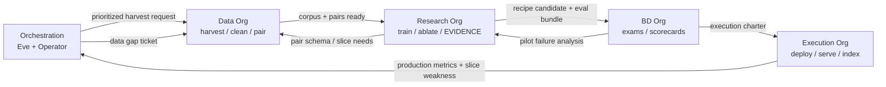

# 0012 — Synthetic Org Divisions, Ownership & Closed Loop

- **Status:** Ready (registry) · **Implemented** (runtime handoffs — see §0)
- **Owner:** Platform / Operator
- **Related specs:** 0002, 0005, 0007, 0008, 0009
- **Machine-readable:** `config/org-divisions.json`
- **Roadmap companion:** `docs/RESEARCH_ORG_ROADMAP.md`

## Problem

Blue Hen RE runs many fleet sites (hub, slasso, arxiviq, dumbmodel, control) plus backend
services under one monorepo. Without explicit **functional divisions**, agents and humans
duplicate work, skip handoffs, or ship claims without the right gate.

We need a normative model: **who owns what**, **what each division delivers**, **what it can
expect from peers**, and how the **closed loop** continuously improves as each sub-org gets better.

## Goals

- Five functional divisions with clear ownership boundaries (not just site names).
- Documented handoff contracts between Data → Research → BD → Execution → Orchestration.
- Map every fleet site to its primary division(s) and public-facing role.
- Ledger stages that signal cross-division work completion.
- Eve / Operator routing rules when gaps are detected.

## Non-goals

- HR org chart or headcount — this is a **synthetic** agent organization.
- Replacing Spec 0002 tenancy — divisions operate **within** workspace isolation.
- Per-division databases — one Postgres + RLS; divisions are logical, not infra silos.

---

## 0. Phase A scope (v0.3) vs full closed loop (Phase A+)

Two hill-climb scopes coexist in the repo. Agents MUST know which they are implementing.

### Phase A — technical hill-climb (implemented today)

| Step | Division | Runtime |
|---|---|---|
| ingest → chunk → pairs | Data | `lifecycle.hill_climb` + `data.py` (ledger: single `collect` stage bundles chunk+pairs) |
| train enqueue | Research | `jobs.launch_train` + ledger `train` (queued) |
| train → eval → deploy → index | Execution | `services/worker/main.py` — ledger stages: `train`, `eval`, `deploy`, `index` |
| orchestration trigger | Orchestration | `kickoff_lifecycle.py`, Eve `hill_climb`, control UI |

**Phase A does not enforce:** BD queue auto-write, pilot/charter ledger stages, or charter-gated
deploy. Worker may deploy when eval gates fail (serving path) — see Spec 0009.

### Phase A+ — full closed loop (implemented)

| Step | Artifact / gate | Runtime |
|---|---|---|
| Research → BD | `content/fleet/bd/queue.json` | Worker `handoffs.submit_bd_candidate` after eval gates pass |
| BD pilot | `content/fleet/bd/scorecards/{siteId}/*.json` | `POST /v1/admin/bd/scorecard` |
| BD → Execution | `config/recipes/{siteId}.json` | `POST /v1/admin/bd/charter` + ledger `charter` |
| Deploy gate | Charter required when `SYNTH_CHARTER_GATE=1` | `deploy_model` + worker; `POST /v1/admin/deploy` for operator promotion |
| Per-org hill-climb | Operator control plane | `POST /v1/admin/hill-climb` |

---

## 1. Division overview

| Division | Codename | Owner | Mission |
|---|---|---|---|
| **Data Harvest & Curation** | `data-org` | Data Steward (`data_harvester`) | Mine, ingest, clean, chunk, pair corpora |
| **Embedding Research** | `research-org` | Research Lead (Cursor lab, Claude autoresearch) | Invent, ablate, measure; promote honest candidates |
| **Business Development & Validation** | `bd-org` | BD Lead (`qa_benchmark`, slasso operators) | Real-world exams vs commercial baselines; charter winners |
| **Business Implementation & Execution** | `execution-org` | Platform SRE (core-api, worker, trainer) | Deploy, serve, index; feed production truth back |
| **Orchestration & Intelligence** | `orchestration-org` | Operator + Eve (`apps/synthorg`, `apps/control`) | Close the loop; route priorities; enforce budgets |

**Team metaphor (user intent):** Data builds datasets for Research. Research builds and tests
approaches for BD. BD tests models on real-world scenarios to guide Execution. Orchestration
(Eve) identifies disconnects and requests more data — completing a **continuous improvement loop**.

---

## 2. Closed loop

### Loop steps (normative order)

1. **Orchestration** identifies weakness (weakest slice, new vertical, stalled ledger) or Operator sets priority.
2. **Data** harvests sources, chunks, generates pairs; logs `collect | chunk | pairs`.
3. **Research** trains with validated recipe, runs eval-harness, updates `EVIDENCE.md`; logs `train | eval`.
4. **Research** submits candidate to `content/fleet/bd/queue.json` when promotion gates pass (Spec 0008). *(Phase A+: manual seed today.)*
5. **BD** runs YAML exams vs commercial baselines; produces scorecard; logs `pilot`.
6. **BD** issues execution charter (approved recipe JSON); logs `charter`.
7. **Execution** deploys checkpoint, builds pgvector index; logs `deploy | index`.
8. **Execution + BD** metrics return to Orchestration; Eve opens data-gap tickets → back to **Data**.

Each sub-org improving (better harvest quality, better recipes, fairer exams, faster deploy)
**raises the floor for every downstream handoff**.

---

## 3. Ownership matrix (RACI-style)

| Asset / decision | Data | Research | BD | Execution | Orchestration |
|---|---|---|---|---|---|
| Raw corpus & pairs | **O** | C | I | I | A |
| Training recipes & experiments | I | **O** | C | I | A |
| EVIDENCE.md claims | I | **O** | C | I | A |
| Benchmark exams & scorecards | C | I | **O** | I | A |
| Execution charters | I | C | **O** | R | A |
| Production deploy & serving | I | I | C | **O** | A |
| Cost ceilings & priorities | I | C | C | C | **O/A** |
| Data-gap backlog | R | C | I | C | **O** |

**O** = owns outcome · **R** = executes on approval · **C** = consulted · **I** = informed · **A** = approves cross-cutting (Operator)

---

## 4. Handoff contracts

Normative detail lives in `config/org-divisions.json`. Summary:

### Data → Research

**Data delivers:**

- Completed ingest/chunk/pairs for `site_id` workspace.
- Corpus snapshot: `data/corpora/{siteId}/corpus.jsonl` (or collection `meta`).
- Quality report: doc count, dedupe rate, avg chunk length, pair count.
- Ledger stages: `collect`, `chunk`, `pairs`.

**Research expects:**

- ≥8 docs, ≥64 pairs for Phase A tenants (24h SLA from harvest request).
- No empty chunks; UTF-8 clean; RLS-scoped workspace.
- Corpus version id in `collection.meta` before train enqueue.

**Research may reject** with: insufficient pairs, train/eval leakage, stale corpus.

### Research → BD

**Research delivers:**

- Queue entry in `content/fleet/bd/queue.json`: recipe JSON, checkpoint path, eval-harness gates, EVIDENCE snapshot date.
- Reproducible command + seed.
- Limitations note (in-domain gain vs zero-shot OOD).

**BD expects:**

- All Spec 0008 gates documented (real-text ΔnDCG, edge tier knn_t8/int8 where applicable).
- No marketing claims without measured row in `EVIDENCE.md`.

**BD may reject** with: exam regression, commercial baseline wins, missing artifact.

### BD → Execution

**BD delivers:**

- Signed charter: approved update to `config/recipes/{siteId}.json`.
- Scorecard JSON: pass/fail per exam, rollout tier notes (full vs MRL/int8).
- Rollback criteria.

**Execution expects:**

- Charter before any production recipe change.
- Checkpoint compatible with `asn-engine` train_loop output.

**Execution may reject** with: deploy gate failure, cost ceiling, RLS test failure.

### Execution → Orchestration (+ BD, Data)

**Execution delivers:**

- Fleet status via `GET /v1/admin/fleet`.
- Ledger stages: `deploy`, `index`.
- Production deltas: nDCG on rotating slice, p95 latency, error rates.

**Orchestration uses** weakness signals to route: new harvest (Data), new experiment (Research), re-pilot (BD).

### Orchestration → All

**Orchestration delivers:**

- Prioritized work orders (Eve tools, `kickoff_lifecycle.py`, Conductor `hill_climb`).
- Data-gap tickets when eval/production shows slice starvation.
- Operator approval for BD → Execution promotion on control plane.

**Budget rule:** never exceed `RESEARCH_COST_CEILING_USD_PER_DAY` per workspace (Spec 0005).

---

## 5. Fleet site → division mapping

Each site may serve **one primary** division and **secondary** surfaces for comms or applied tests.

| Site id | Domain | Primary division | Secondary | Public role |
|---|---|---|---|---|
| **hub** | bhenre.com | Orchestration (comms) | Research, Data (health) | Platform hub: ledger, fleet map, experiment museum, data health tiles |
| **control** | jcamd.com | Orchestration | — | Operator control plane: approvals, pair-programming, cross-org priorities |
| **synthorg** | — | Orchestration | — | Eve Chief of Staff — delegates lifecycle, gap detection, routing |
| **benchmark-lab** | slasso.com | BD | Research (method refs) | YAML exams, leaderboards, candidate queue UI |
| **dumbmodel** | dumbmodel.com | BD | Research (honesty) | Public proof: Hall of Cone, anti-hype baseline compare |
| **research-rag** | arxiviq.com | Research (applied) | **Data** (arxiv ingest) | Applied science demo: retrieve → exam; methods museum |
| **finance-lab** | TBD (Phase B) | BD (applied) | Data, Research | Finance simulation exams — not production advice |

### research-rag internal split (dual hat)

| Concern | Owner division | Surface |
|---|---|---|
| arXiv PDF harvest, chunking, pair gen | **Data** | core-api ingest + `data/corpora/research-rag/` |
| Method bake-offs, recipe promotion | **Research** | `/methods`, autoresearch, EVIDENCE rows |
| Exam UX vs commercial RAG | **BD** | `ArxivExamDemo`, slasso-linked exams |
| Live `/v1/search` after charter | **Execution** | core-api + worker |

---

## 6. Per-site expectations (what visitors / agents see)

### hub (bhenre.com)

- **Owns (Orchestration comms):** cross-org lifecycle tiles, experiment ledger viewer, closed-loop status diagram.
- **Shows from peers:** Data health (doc/pair counts), Research museum cards, BD queue depth, Execution fleet row per org.
- **Does not:** run exams (BD) or edit recipes (Research) without linking to authoritative surface.

### control (jcamd.com)

- **Owns:** Operator approvals (charter sign-off), cost ceiling overrides, pair-programming entry.
- **Expects from BD:** pending charter list with scorecards attached.
- **Expects from Execution:** deploy blockers and incident summaries.

### benchmark-lab (slasso.com)

- **Owns:** exam definitions, leaderboard integrity, commercial baseline panel config.
- **Expects from Research:** queue entries with reproducible artifacts.
- **Delivers to Execution:** charter JSON on pass; to Research: failure slice analysis.

### dumbmodel.com

- **Owns:** public-facing honesty layer — shareable scores, Hall of Cone, no overclaim copy.
- **Expects from BD:** same exams as internal scorecards (fairness SLA).
- **Expects from Research:** EVIDENCE snapshot dates on every public metric.

### arxiviq.com (research-rag)

- **Data org:** maintains arXiv corpus freshness; responds to Orchestration gap tickets ("need more CS.CL papers").
- **Research org:** runs applied method comparisons on this corpus; links to hub museum.
- **BD org:** exam scenarios that mirror real researcher workflows (multi-hop, citation grounding).
- **Execution org:** serves embeddings post-charter; two-tier toggle in demo UI.

---

## 7. Agents & tools by division

| Division | Agents / scripts | Key tools |
|---|---|---|
| Data | `data_harvester` (Eve subagent) | `POST /v1/data/*`, worker ingest stage |
| Research | Cursor lab, Claude autoresearch, Conductor | `autoresearch_*`, `bayes_search.py`, eval-harness |
| BD | `qa_benchmark`, benchmark-lab operators | `eval-public`, `content/fleet/bd/queue.json`, YAML exams |
| Execution | worker, core-api, trainer | `/v1/model/deploy`, `/v1/embed`, `/v1/search` |
| Orchestration | Eve, Operator | `hill_climb`, `kickoff_lifecycle.py`, control UI |

---

## 8. Ledger stages (cross-division signals)

Append-only `auto_research_ledger` (Spec 0005). Stages by division:

| Stage | Division | Meaning |
|---|---|---|
| `collect` | Data | Raw sources ingested |
| `chunk` | Data | Chunking complete |
| `pairs` | Data | Contrastive pairs ready — **Research may enqueue train** |
| `train` | Research | Training job started/completed |
| `eval` | Research | Eval-harness gates run |
| `pilot` | BD | Real-world exam scorecard recorded |
| `charter` | BD | Execution approved to deploy |
| `deploy` | Execution | Checkpoint promoted |
| `index` | Execution | pgvector index built — **loop metrics live** |

Orchestration monitors stall: e.g. `pairs` without `train` > 48h → escalate Research; `eval` without queue entry → remind promotion criteria.

---

## 9. Continuous improvement (how divisions lift each other)

| If this division improves… | Downstream benefit |
|---|---|
| **Data** — cleaner pairs, hard negatives, fresher corpus | Research trains on signal, not noise; BD exams become harder/fairer |
| **Research** — better Barlow recipes, honest EVIDENCE | BD pilots win on merit; Execution deploys worthier checkpoints |
| **BD** — sharper exams, baseline panel | Research gets actionable failure modes; Data knows which slices to feed |
| **Execution** — faster deploy, stable edge tier | BD runs more pilots; Orchestration trusts production metrics |
| **Orchestration** — faster gap routing | Entire loop spins faster; fewer stale corpora and orphan experiments |

**Eve's role:** detect disconnects (e.g. Research claims gain but BD queue empty; Execution deployed but Data corpus 90 days stale) and file routed work orders — never bypass division ownership.

---

## 10. Contract (API & files)

- Division registry: `config/org-divisions.json` — agents SHOULD read before cross-org work.
- Fleet sites gain optional fields: `orgDivision`, `deliversTo`, `expectsFrom` (Spec 0007 extension).
- BD queue: `content/fleet/bd/queue.json` — Research writes (Phase A+: automated), BD consumes; loaded via `@synthaembed/fleet` `getBdQueue()`.
- Scorecards: `content/fleet/bd/scorecards/{siteId}/{timestamp}.json` — BD writes, Execution reads for charter.
- Charters: `config/recipes/{siteId}.json` — BD approval required before Execution deploy *(Phase A+: not enforced yet)*.
- Runtime corpora/artifacts: `/data/corpora/`, `/data/artifacts/` — gitignored; mount or harvest in prod.

---

## Acceptance criteria

### Registry (Ready)

1. `config/org-divisions.json` lists five divisions with owns/delivers/expectsFrom. ✅
2. `config/fleet.json` sites include `orgDivision` (and handoff hints). ✅
3. This spec documents closed loop, site mapping, and ledger stages. ✅
4. `specs/README.md` indexes 0012. ✅
5. Specs 0005, 0007, 0009 cross-link to 0012. ✅
6. `content/fleet/bd/queue.json` tracked in git; slasso `/queue` reads via `@synthaembed/fleet`. ✅

### Runtime handoffs (Implemented — Phase A+)

7. Worker auto-appends BD queue after eval gates pass. ✅ `services/worker/main.py` + `handoffs.py`
8. Execution rejects deploy without BD charter file (when `SYNTH_CHARTER_GATE=1`). ✅ `models_svc.deploy_model`
9. Hub UI renders closed-loop diagram from `org-divisions.json`. ✅ `ClosedLoopDiagram` on hub
10. Operations Center: per-site hill-climb + charter/deploy promotion. ✅ `apps/control/actions`

## Test plan

- Manual: trace one hypothetical promotion (research-rag Barlow candidate) through all five divisions using ledger stages.
- CI: `pnpm review` unchanged; optional JSON schema validate `org-divisions.json` (future).

## Risks

- **Role confusion on research-rag** — mitigated by §5 dual-hat table; agents must declare division in PR description.
- **Skipping BD** — Execution MUST enforce charter check (Spec 0008 deploy gates) — **Phase A+**; v0.3 worker deploys for serving without charter.
- **Registry drift** — update `org-divisions.json` + `fleet.json` in same PR as division boundary changes.
