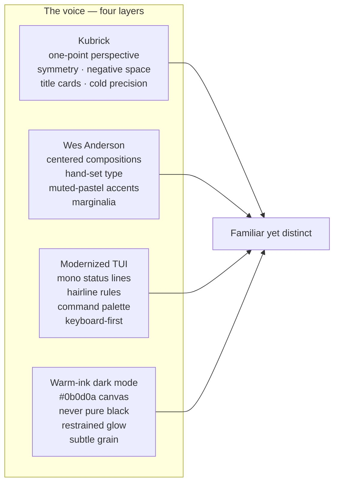

# Spec 0017 — Fleet tastemaker redesign: Kubrick × Wes Anderson × modernized TUI

- **Status:** Ready
- **Owner:** Operator
- **Related specs:** [0007](./0007-fleet-registry-and-sites.md) (fleet registry & sites), [0015](./0015-venture-fleet.md) (venture fleet), [0012](./0012-synthetic-org-divisions-and-handoffs.md) (org voice)
- **Supersedes:** none — extends `docs/DESIGN_SYSTEM.md` v0.1

## Problem

The fleet has 7 active surfaces (5 public ventures + 2 operator-facing) sharing one design system (`@synthaembed/ui-fleet`, `bh-*` tokens). The foundation is correct — warm ink, honest borders, per-site accents — but the surfaces read as *competent* rather than *distinctive*. They share a visual language without sharing a *point of view*. The venture rebrand (spec 0015) settled naming and roles; this spec settles the **visual voice**: one governed, unmistakable look across every site that feels "familiar yet distinct" rather than templated.

Why now: the rebrand is complete (Phase 1–8 done), ventures are shipping, and the next visible leap is craft, not architecture.

## Goals

- One unified visual voice across all 7 sites — recognizable as the same hand on every surface.
- A design language with a named point of view: **Kubrick one-point perspective × Wes Anderson symmetry & title cards × modernized TUI hairline/mono texture × warm-ink dark mode**.
- "Familiar yet distinct": keep Next/web conventions (header, footer, CTA, search, command palette) but render them through this single lens.
- Implementable incrementally inside the existing `bh-*` token system — no rewrite, no new framework.
- Every site passes WCAG AA, `pnpm review`, and a symmetry/axis lint.

## Non-goals

- Rewriting site information architecture (settled in 0007/0015).
- Changing the `FleetShell` header/footer org-story model (already correct).
- Introducing new brand accents per site — only tuning saturation of the existing family.
- ML/eval changes (out of scope; governed by 0003/0008).
- B2C voice shift — copy stays enterprise B2B per `docs/VOICE_AND_PLATFORM.md`.

## Design — the synthesis

Four layers, blended. Each layer names its job; together they form the voice.



### Kubrick layer (structure)
- **One-point perspective:** a centered reading axis on every page (`--bh-axis`); content vanishes toward a single implied point.
- **Symmetry:** hero/title content centered on desktop ≥768px; nothing drifts off-axis without reason.
- **Negative space:** monolithic breathing room — sections separated by `--bh-space-16`, not crowded.
- **Cold precision:** the 4px spacing scale is law; no ad-hoc padding; every gap is a token multiple.
- **Title cards:** every homepage opens with a TitleCard (Kubrick overture frame).

### Wes Anderson layer (warmth + character)
- **Centered, hand-set compositions:** Instrument Serif titles set with intent, not default flow.
- **Title cards with thin rules:** a hairline above and below the title; mono eyebrow label; optional marginalia caption.
- **Muted-pastel accent family held inside warm ink:** clay, moss, hen-blue, cone-rust, slate-blue (already in tokens), desaturated slightly so all 7 read as one family.
- **Chapter/section cards:** `<RuledSection>` with a mono section label — the page reads like chapters, not a scroll of boxes.
- **Marginalia:** small mono side-labels/captions — twee but disciplined.

### Modernized TUI layer (texture + familiarity)
- **Monospace status line:** IBM Plex Mono top bar — `site · section · status · time` — hairline border.
- **Hairline ruled borders:** 1px `--bh-rule` for texture lines, distinct from the 2px structural border.
- **Prominent command palette:** existing `CommandPalette` elevated as a first-class affordance; `Cmd+K` always available.
- **Line-drawn frames:** `<TTYFrame>` for data panels — refined hairline box, not ASCII art.
- **Keyboard-first:** visible focus rings, `44px` tap targets, no hover-only interactions.
- **The "familiar" lives here:** TUI conventions read as *tooling*, which is what this product is — evaluation/observability/research tooling — so the texture matches the job.

### Dark mode layer
- **Warm ink canvas:** `--bh-canvas: #0b0d0a` — never pure black anywhere.
- **Restrained accent glows:** `--bh-glow-accent` used sparingly, only on focus/active.
- **Subtle grain:** existing SVG noise overlay on `.fleet-shell` retained.

## Contract — additions to `@synthaembed/ui-fleet`

### New tokens ([packages/ui-fleet/src/tokens.css](../packages/ui-fleet/src/tokens.css))

```css
:root {
  /* Axis — Kubrick one-point column */
  --bh-axis: 720px;
  --bh-axis-wide: 1080px;          /* data pages that need more room */

  /* Hairline rule — TUI texture, distinct from 2px structural border */
  --bh-rule: 1px solid var(--bh-border);
  --bh-rule-strong: 1px solid var(--bh-border-strong);

  /* Title card / status bar insets */
  --bh-card-title-bg: var(--bh-surface-raised);
  --bh-status-bar-bg: var(--bh-canvas-elevated);

  /* Motion — Kubrick slow push */
  --bh-duration-axis: 400ms;
}
```

Per-site accent **desaturation pass** (no new accents — tune existing family so all 7 sit in one muted register). Targets remain AA-compliant on `--bh-canvas` (see Acceptance #3). Concretely: reduce saturation ~8–12% on `--bh-hen-blue`, `--bh-moss`, `--bh-clay`, `--bh-cone-rust`, `--bh-slate-blue` and their `-dim` partners, re-deriving `-muted` rgba tints to match.

### New primitives ([packages/ui-fleet/src/components.css](../packages/ui-fleet/src/components.css) + new React files in `packages/ui-fleet/src/`)

| Component | Job | Source |
|---|---|---|
| `<TitleCard>` | Wes chapter card: centered Instrument Serif title, hairline rule above/below, mono eyebrow, optional `<Marginalia>` | `TitleCard.tsx` |
| `<Axis>` | Kubrick centered one-point column; `max-width: var(--bh-axis)`, `margin-inline: auto`; collapses left <768px | `Axis.tsx` |
| `<RuledSection>` | Hairline top rule + mono section label; wraps a chapter of content | `RuledSection.tsx` |
| `<StatusLine>` | TUI top status bar: `site · section · status · time`, mono, hairline border | `StatusLine.tsx` |
| `<TTYFrame>` | Line-drawn hairline frame for data panels (1px, not ASCII) | `TTYFrame.tsx` |
| `<Marginalia>` | Small mono side-label/caption | `Marginalia.tsx` |

All exported from the `@synthaembed/ui-fleet` barrel. All client-safe (no new server deps).

### Layout rule (the spine of every homepage)

```
<FleetShell siteId>
  <StatusLine site section status />        ← TUI texture, top of main
  <Axis>                                     ← Kubrick one-point column
    <TitleCard eyebrow title marginalia />   ← Wes overture
    <RuledSection label>…</RuledSection>     ← chapters
    <RuledSection label>…</RuledSection>
  </Axis>
</FleetShell>
```

Existing `FleetShell` header/footer stay (they carry the org story per 0007). New primitives live inside `<main>`. Non-homepage pages adopt `<Axis>` + `<RuledSection>` incrementally; `<StatusLine>` and `<TitleCard>` are homepage-mandatory, page-optional.

### Per-site accent
Retain the `data-site` accent system in `tokens.css`. Harmonize saturation (above) so all 7 sit in the same Wes-Anderson-muted family. **No new accents.** Site overrides only in per-site `app/globals.css` scoped to `[data-site="…"]`.

### Motion
Kubrick slow pushes: axis/title reveals use `--bh-duration-axis: 400ms` with `--bh-ease-out`. No bouncy easings. `prefers-reduced-motion` honored (reveals instant).

## Data model
None. CSS + React only; no migrations, no API changes.

## Acceptance criteria

1. All 7 sites (`storefront`, `hq`, `dumbmodel`, `validation`, `research`, `observatory`, `simulation`) render homepages through `<FleetShell>` + `<StatusLine>` + `<Axis>` + `<TitleCard>` + at least one `<RuledSection>`.
2. No pure black anywhere — `rg -i "#000(000)?\b" apps/sites packages/ui-fleet` returns zero matches in CSS values.
3. Every per-site accent (`--bh-accent`) passes WCAG AA 4.5:1 against `--bh-canvas` text usage — verified by an automated contrast check script in `scripts/` (new).
4. `pnpm review` passes — all sites build + typecheck.
5. Centered-axis symmetry on desktop ≥768px; collapses to left-aligned <768px (mobile-first).
6. All tappable elements ≥44px (audited via the same `scripts/` tool).
7. `<StatusLine>` renders `site · section · status · time`; `<TitleCard>` present on every homepage.
8. No new design tokens introduced outside `tokens.css`; site overrides only in per-site `app/globals.css` scoped to `[data-site]`.
9. `prefers-reduced-motion` disables axis/title reveals (instant render).
10. New primitives exported from `@synthaembed/ui-fleet` barrel import in at least one site without type errors.

## Test plan

- **Unit/type:** `pnpm review` (build + typecheck all sites) — covers primitive exports + usage.
- **A11y:** new `scripts/check-tastemaker.mjs` (or `.py`) — parses computed CSS values for (a) pure-black, (b) accent-on-canvas contrast ratios, (c) tap-target min sizes from rendered HTML. Runs in CI gate.
- **Visual:** `scripts/fleet-review.ps1 -Open` screenshots all 7 sites before/after each phase; human (Operator) signs off the look.
- **Symmetry lint:** a grep/AST check that homepage `<main>` contains an `<Axis>` wrapper.

## Evaluation gate
Not applicable — no ML in this spec.

## Rollout & rollback

Phases are sequenced as SITE-* tasks in `config/work_queue.json` (queued separately by an agent after spec sign-off). Each phase is independently shippable; each ships behind `pnpm review` green.

1. **Tokens + primitives in `ui-fleet`** — add tokens, build the 6 components, export from barrel. No site changes. Ship when `pnpm review` green.
2. **Pilot on `storefront` homepage** (bhenre.com) — convert homepage to the spine layout. Operator screenshot review.
3. **Roll to `hq`, `dumbmodel`, `validation`, `research`, `observatory`, `simulation`** — one PR per site, same spine.
4. **Per-site accent desaturation + contrast verification** — tune `tokens.css` accent family; run `scripts/check-tastemaker.mjs`.
5. **Copy/marginalia pass** — title cards, section labels, marginalia aligned to `docs/VOICE_AND_PLATFORM.md`.
6. **Validate** — `pnpm review`, `scripts/check-tastemaker.mjs` in CI, `scripts/fleet-review.ps1 -Open` Operator sign-off.

**Rollback:** each phase is a revertible commit set. Tokens are additive (no removals of existing tokens), so a partial rollout does not break sites that haven't adopted the primitives yet — they simply don't use them.

## Risks

- **Kubrick coldness vs Wes warmth** — risk of reading sterile. Mitigation: warm-ink canvas (not pure black) + muted-pastel accents + Instrument Serif humanism on titles.
- **TUI borders overwhelming** — risk of visual noise. Mitigation: hairline `--bh-rule` (1px) is distinct from structural 2px borders; never mix the two within one panel; TUI texture only on `<StatusLine>` and `<TTYFrame>`.
- **Symmetry breaks on mobile** — centered axis can feel cramped <768px. Mitigation: `<Axis>` collapses to left-aligned below 768px (Acceptance #5); symmetry is a desktop property.
- **Desaturation drift** — tuning accents could push a site below AA. Mitigation: automated contrast check (Acceptance #3) gates the change.
- **Scope creep into IA** — tempting to restructure pages. Mitigation: Non-goal #1; this spec is visual voice only.
