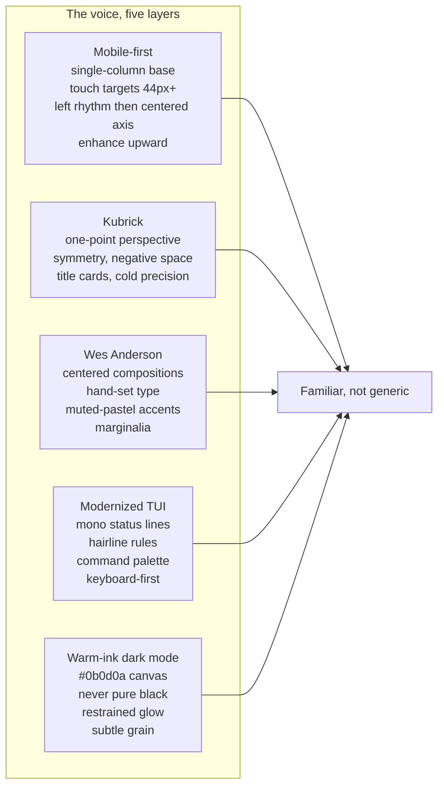

# Spec 0017: Fleet tastemaker redesign, Kubrick × Wes Anderson × modernized TUI

- **Status:** Ready
- **Owner:** Operator
- **Related specs:** [0007](./0007-fleet-registry-and-sites.md) (fleet registry & sites), [0015](./0015-venture-fleet.md) (venture fleet), [0012](./0012-synthetic-org-divisions-and-handoffs.md) (org voice)
- **Supersedes:** none; extends `docs/DESIGN_SYSTEM.md` v0.1

## Problem

Seven active surfaces (five public ventures, two operator-facing) share one design system (`@synthaembed/ui-fleet`, `bh-*` tokens). The foundation holds: warm ink, honest borders, per-site accents. What the surfaces lack is a point of view. They read as competent, not distinctive. Spec 0015 settled naming and roles. This spec settles the look: one governed, unmistakable hand across every site, templated from nothing.

Why now: the rebrand is done (phases 1 through 8), ventures are shipping, and the next thing worth doing is craft.

## Goals

- One visual voice across all 7 sites, recognizable as the same hand on every surface.
- A named point of view for that voice: Kubrick one-point perspective, Wes Anderson symmetry and title cards, modernized-TUI hairline and mono texture, warm-ink dark mode.
- Keep Next/web conventions (header, footer, CTA, search, command palette) but pass them through this lens so the result reads familiar without reading generic.
- Implement inside the existing `bh-*` token system. No rewrite, no new framework.
- Every site passes WCAG AA, `pnpm review`, and a symmetry/axis lint.

## Non-goals

- Rewriting site information architecture (settled in 0007/0015).
- Changing the `FleetShell` header/footer org-story model (already correct).
- Introducing new brand accents per site. Only tuning saturation of the existing family.
- ML/eval changes (out of scope; governed by 0003/0008).
- B2C voice shift. Copy stays enterprise B2B per `docs/VOICE_AND_PLATFORM.md`.

## Design: the synthesis

Mobile-first is the floor, not a responsive afterthought. Every layer below is authored at the smallest screen first (single column, touch targets, left-aligned rhythm) and widens upward. Symmetry and the centered axis arrive at 768px; wider axes at 1024px. Desktop-first layouts that get "collapsed" downward are rejected. The mobile layout is the source of truth; the desktop layout is a widening.

Five layers. Mobile-first is the floor; the other four are the voice.



### Mobile-first layer (the floor)
- Single-column base. Every page starts as one column at `100%` width minus `--bh-space-4` gutters. Multi-column grids arrive at breakpoints; they are never the default.
- Touch-first. Interactive elements measure 44×44px or larger from the base up. No hover-only interactions; every hover has a tap equivalent.
- Left rhythm becomes centered axis. Below 768px, eyebrows, titles, and body are left-anchored. The centered `<Axis>` engages at 768px. Symmetry is a widening, not a starting state.
- Readable measure. Body text is capped at `--bh-axis-narrow: 640px` on every screen so lines never stretch past comfortable reading on wide viewports.
- No horizontal scroll. Every page passes an `overflow-x` audit at 320px.
- Status line reflows. `<StatusLine>` stacks to two rows below 480px (`site · section` over `status · time`) instead of truncating.
- Breakpoints. `480px`, `768px`, `1024px`, applied with `@media (min-width: …)`. Never `max-width`.

### Kubrick layer (structure)
- One-point perspective. A centered reading axis on every page (`--bh-axis`); content vanishes toward a single implied point. It engages at 768px; below that the axis is a full-width left-aligned column (see Mobile-first layer).
- Symmetry. Hero and title content centers on desktop (768px and up); nothing drifts off-axis without reason. On mobile the same content is left-anchored. Symmetry is earned at the widening, not assumed.
- Negative space. Sections separated by `--bh-space-16`. Breathing room, not crowding.
- Cold precision. The 4px spacing scale is law. No ad-hoc padding; every gap is a token multiple.
- Title cards. Every homepage opens with a `TitleCard` (the Kubrick overture frame).

### Wes Anderson layer (warmth and character)
- Centered, hand-set compositions. Instrument Serif titles set with intent, not left to default flow.
- Title cards with thin rules. A hairline above and below the title, a mono eyebrow label, an optional marginalia caption.
- Muted-pastel accent family held inside warm ink. Clay, moss, hen-blue, cone-rust, slate-blue (already in tokens), desaturated slightly so all 7 read as one family.
- Chapter/section cards. `<RuledSection>` with a mono section label. The page reads like chapters, not a scroll of boxes.
- Marginalia. Small mono side-labels and captions. Twee but disciplined.

### Modernized TUI layer (texture and familiarity)
- Monospace status line. IBM Plex Mono top bar reading `site · section · status · time`, hairline border.
- Hairline ruled borders. 1px `--bh-rule` for texture lines, distinct from the 2px structural border.
- Prominent command palette. The existing `CommandPalette` becomes a first-class affordance; `Cmd+K` is always available.
- Line-drawn frames. `<TTYFrame>` for data panels: a refined hairline box, not ASCII art.
- Keyboard-first. Visible focus rings, 44px tap targets, no hover-only interactions.
- The familiar register lives here. TUI conventions read as tooling, which is what this product is (evaluation, observability, research tooling), so the texture matches the job.

### Dark mode layer
- Warm ink canvas. `--bh-canvas: #0b0d0a`. Never pure black.
- Restrained accent glows. `--bh-glow-accent` used sparingly, only on focus and active.
- Subtle grain. The existing SVG noise overlay on `.fleet-shell` stays.

## Contract: additions to `@synthaembed/ui-fleet`

### New tokens ([packages/ui-fleet/src/tokens.css](../packages/ui-fleet/src/tokens.css))

```css
:root {
  /* Axis: Kubrick one-point column. Mobile-first: the axis is full-width
     left-aligned by default; centering engages at 768px and up (see Axis.tsx). */
  --bh-axis: 720px;
  --bh-axis-narrow: 640px;        /* body text measure cap on every screen */
  --bh-axis-wide: 1080px;         /* data pages that need more room */

  /* Mobile-first breakpoints. Use with @media (min-width: …) only. */
  --bh-bp-sm: 480px;
  --bh-bp-md: 768px;
  --bh-bp-lg: 1024px;

  /* Hairline rule: TUI texture, distinct from the 2px structural border */
  --bh-rule: 1px solid var(--bh-border);
  --bh-rule-strong: 1px solid var(--bh-border-strong);

  /* Title card / status bar insets */
  --bh-card-title-bg: var(--bh-surface-raised);
  --bh-status-bar-bg: var(--bh-canvas-elevated);

  /* Motion: Kubrick slow push */
  --bh-duration-axis: 400ms;
}
```

Per-site accent **desaturation pass**: no new accents. Tune the existing family so all 7 sit in one muted register, and keep targets AA-compliant on `--bh-canvas` (see Acceptance 3). Concretely, reduce saturation roughly 8 to 12 percent on `--bh-hen-blue`, `--bh-moss`, `--bh-clay`, `--bh-cone-rust`, `--bh-slate-blue` and their `-dim` partners, and re-derive the `-muted` rgba tints to match.

### New primitives ([packages/ui-fleet/src/components.css](../packages/ui-fleet/src/components.css) + new React files in `packages/ui-fleet/src/`)

| Component | Job | Source |
|---|---|---|
| `<TitleCard>` | Wes chapter card: centered Instrument Serif title, hairline rule above/below, mono eyebrow, optional `<Marginalia>` | `TitleCard.tsx` |
| `<Axis>` | Kubrick one-point column. Mobile-first: full-width left-aligned below 768px; `max-width: var(--bh-axis)`, `margin-inline: auto`, centered at 768px and up | `Axis.tsx` |
| `<RuledSection>` | Hairline top rule + mono section label; wraps a chapter of content | `RuledSection.tsx` |
| `<StatusLine>` | TUI top status bar: `site · section · status · time`, mono, hairline border | `StatusLine.tsx` |
| `<TTYFrame>` | Line-drawn hairline frame for data panels (1px, not ASCII) | `TTYFrame.tsx` |
| `<Marginalia>` | Small mono side-label/caption | `Marginalia.tsx` |

All exported from the `@synthaembed/ui-fleet` barrel. All client-safe (no new server deps).

### Layout rule (the spine of every homepage)

```
<FleetShell siteId>
  <StatusLine site section status />        ← TUI texture, top of main
  <Axis>                                     ← Kubrick one-point column
    <TitleCard eyebrow title marginalia />   ← Wes overture
    <RuledSection label>…</RuledSection>     ← chapters
    <RuledSection label>…</RuledSection>
  </Axis>
</FleetShell>
```

Existing `FleetShell` header/footer stay (they carry the org story per 0007). New primitives live inside `<main>`. Non-homepage pages adopt `<Axis>` and `<RuledSection>` incrementally; `<StatusLine>` and `<TitleCard>` are homepage-mandatory, page-optional.

**Mobile-first authoring rule.** Write every page's base CSS at 320 to 479px (single column, left rhythm, touch targets), then add `@media (min-width: 480px)`, `(min-width: 768px)`, `(min-width: 1024px)` enhancements. Never use `max-width` queries. The `<Axis>` component encodes this: full-width left-aligned by default, centers itself only at 768px and up.

### Per-site accent
Retain the `data-site` accent system in `tokens.css`. Harmonize saturation as above so all 7 sit in the same Wes-Anderson-muted family. No new accents. Site overrides only in per-site `app/globals.css` scoped to `[data-site="…"]`.

### Motion
Kubrick slow pushes. Axis and title reveals use `--bh-duration-axis: 400ms` with `--bh-ease-out`. No bouncy easings. `prefers-reduced-motion` is honored (reveals render instantly).

## Data model
None. CSS + React only; no migrations, no API changes.

## Acceptance criteria

1. All 7 sites (`storefront`, `hq`, `dumbmodel`, `validation`, `research`, `observatory`, `simulation`) render homepages through `<FleetShell>` + `<StatusLine>` + `<Axis>` + `<TitleCard>` + at least one `<RuledSection>`.
2. No pure black anywhere. `rg -i "#000(000)?\b" apps/sites packages/ui-fleet` returns zero matches in CSS values.
3. Every per-site accent (`--bh-accent`) passes WCAG AA 4.5:1 against `--bh-canvas` text usage, verified by an automated contrast check script in `scripts/` (new).
4. `pnpm review` passes (all sites build + typecheck).
5. Mobile-first axis. `<Axis>` is full-width left-aligned below 768px and centered with `max-width: var(--bh-axis)` at 768px and up. All breakpoints use `@media (min-width: …)`; no `max-width` queries in new CSS. `rg "@media \(max-width" packages/ui-fleet apps/sites` returns zero in files touched by this spec.
6. No horizontal scroll at a 320px viewport width, verified by the visual/screenshots pass and an `overflow-x` audit in `scripts/check-tastemaker.mjs`.
7. All tappable elements are 44×44px or larger at every breakpoint (audited via the same `scripts/` tool).
8. `<StatusLine>` renders `site · section · status · time`; below 480px it reflows to two rows (`site · section` over `status · time`) without truncation. `<TitleCard>` is present on every homepage.
9. No new design tokens introduced outside `tokens.css`; site overrides only in per-site `app/globals.css` scoped to `[data-site]`.
10. `prefers-reduced-motion` disables axis/title reveals (instant render).
11. New primitives exported from the `@synthaembed/ui-fleet` barrel import in at least one site without type errors.
12. Body text measure is at most `--bh-axis-narrow` (640px) on every viewport; no line stretches past readable measure on wide screens.

## Test plan

- **Unit/type.** `pnpm review` (build + typecheck all sites) covers primitive exports and usage.
- **A11y.** New `scripts/check-tastemaker.mjs` (or `.py`) parses computed CSS values for (a) pure-black, (b) accent-on-canvas contrast ratios, (c) tap-target min sizes from rendered HTML. Runs in the CI gate.
- **Mobile-first audits (in the same script).** (d) no `@media (max-width …)` in files touched by this spec, (e) no horizontal overflow at a 320px viewport, (f) `<Axis>` computed `text-align` is left at 360px and centered at 800px, (g) `<StatusLine>` stacks at 360px.
- **Visual.** `scripts/fleet-review.ps1 -Open` screenshots all 7 sites at 320px, 768px, and 1280px before and after each phase. Operator signs off the look at every width.
- **Symmetry lint.** A grep/AST check that homepage `<main>` contains an `<Axis>` wrapper.

## Evaluation gate
Not applicable. No ML in this spec.

## Rollout & rollback

Phases are sequenced as SITE-* tasks in `config/work_queue.json` (queued separately by an agent after spec sign-off). Each phase is independently shippable and ships behind a green `pnpm review`.

1. **Tokens + primitives in `ui-fleet`.** Add tokens, build the 6 components, export from the barrel. No site changes. Ship when `pnpm review` is green.
2. **Pilot on the `storefront` homepage** (bhenre.com). Convert the homepage to the spine layout. Operator screenshot review.
3. **Roll to `hq`, `dumbmodel`, `validation`, `research`, `observatory`, `simulation`.** One PR per site, same spine.
4. **Per-site accent desaturation + contrast verification.** Tune the `tokens.css` accent family; run `scripts/check-tastemaker.mjs`.
5. **Copy/marginalia pass.** Title cards, section labels, and marginalia aligned to `docs/VOICE_AND_PLATFORM.md`.
6. **Validate.** `pnpm review`, `scripts/check-tastemaker.mjs` in CI, `scripts/fleet-review.ps1 -Open` Operator sign-off.

**Rollback.** Each phase is a revertible commit set. Tokens are additive (no existing tokens removed), so a partial rollout does not break sites that have not adopted the primitives yet; they simply do not use them.

## Risks

- **Kubrick coldness vs Wes warmth.** Risk: the look reads sterile. Mitigation: warm-ink canvas (not pure black), muted-pastel accents, Instrument Serif humanism on titles.
- **TUI borders overwhelming.** Risk: visual noise. Mitigation: the 1px hairline `--bh-rule` is distinct from the 2px structural border; never mix the two within one panel; TUI texture lives only on `<StatusLine>` and `<TTYFrame>`.
- **Symmetry arrives late, not never.** Mobile-first means the centered axis engages at 768px; below that the page is left-aligned. Risk: the desktop "Kubrick" feel reads as absent on mobile. Mitigation: title cards and hairline rules still carry the voice at 320px. Symmetry is one register of the voice, not the whole of it.
- **Desaturation drift.** Risk: tuning pushes a site below AA. Mitigation: the automated contrast check (Acceptance 3) gates the change.
- **Mobile-first discipline slips.** Risk: authors reach for `max-width` queries or desktop-first layouts. Mitigation: Acceptance 5 forbids `max-width` queries in spec-touched files; `check-tastemaker.mjs` enforces it.
- **Scope creep into IA.** Risk: pages get restructured under cover of redesign. Mitigation: Non-goal 1; this spec is visual voice only.
